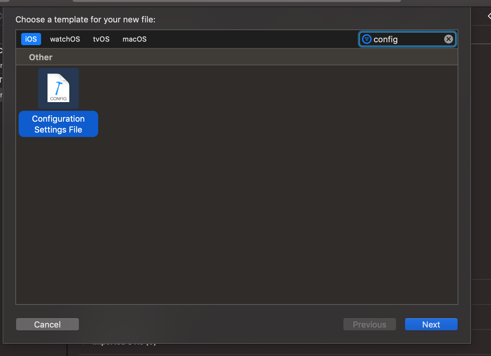
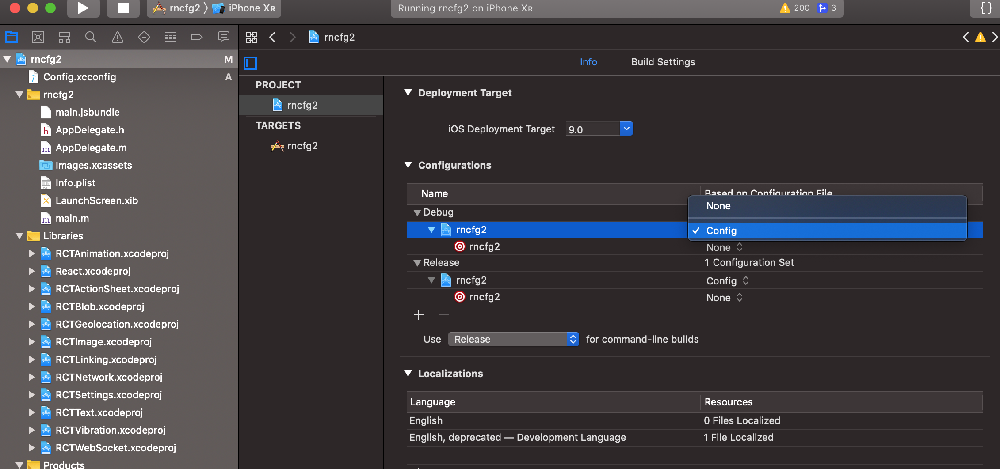
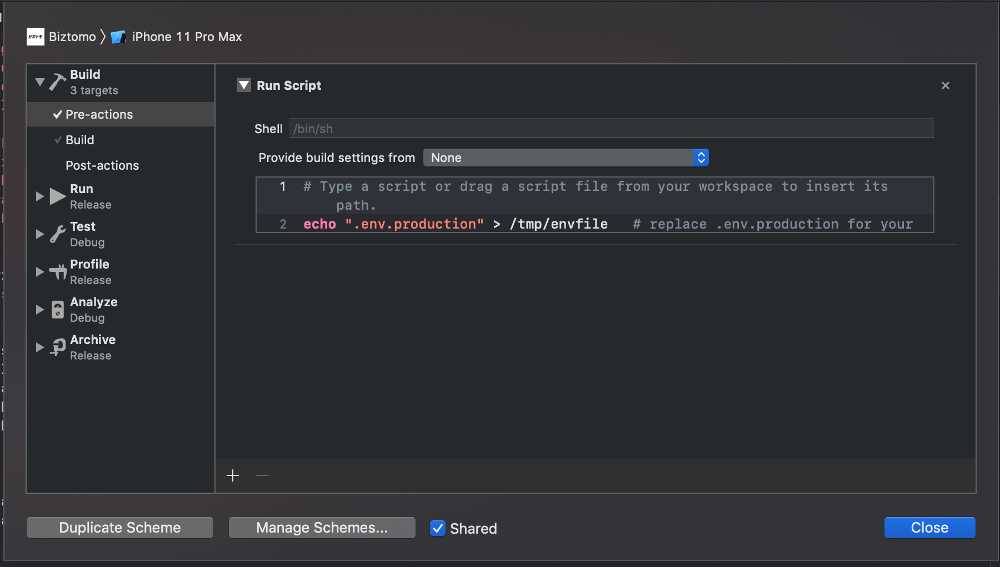

## Config libraries

## [react-native-config](https://github.com/luggit/react-native-config) (Config variables for React Native apps)

## IOS
#### Step 1
##### Availability in Build settings and Info.plist
With one extra step environment values can be exposed to "Info.plist" and Build settings in the native project.

1. click on the file tree and create new file of type XCConfig
   
   
2. save it under `ios` folder as "Config.xcconfig" with the following content:

```
#include? "tmp.xcconfig"
```

3. add the following to your ".gitignore":
```
# react-native-config codegen
ios/tmp.xcconfig

```
#### Step 2
##### Go to project settings
Apply ``Config`` to your configurations
   

#### Step 3
Add ``.env`` to your schema
   

#### Step 4 add to your pod file 
```js
  post_install do |installer|
   installer.pods_project.targets.each do |target|
     if target.name == ‘react-native-config’
        phase = target.project.new(Xcodeproj::Project::Object::PBXShellScriptBuildPhase)
        phase.shell_script = “cd ../../“\
        ” && RNC_ROOT=./node_modules/react-native-config/“\
        ” && export SYMROOT=$RNC_ROOT/ios/ReactNativeConfig”\
        ” && ruby $RNC_ROOT/ios/ReactNativeConfig/BuildDotenvConfig.ruby”
        target.build_phases << phase
        target.build_phases.move(phase,0)
      end
    end
   end
```

#### Step 5
- Go to your project -> ``Build Settings`` -> ``All``
- Search for ``preprocess``
- Set Preprocess ``Info.plist`` File to ``Yes``
- Set ``Info.plist`` Preprocessor Prefix File to ``${BUILD_DIR}/GeneratedInfoPlistDotEnv.h``
- Set ``Info.plist`` Other Preprocessor Flags to ``-traditional``


## Android
