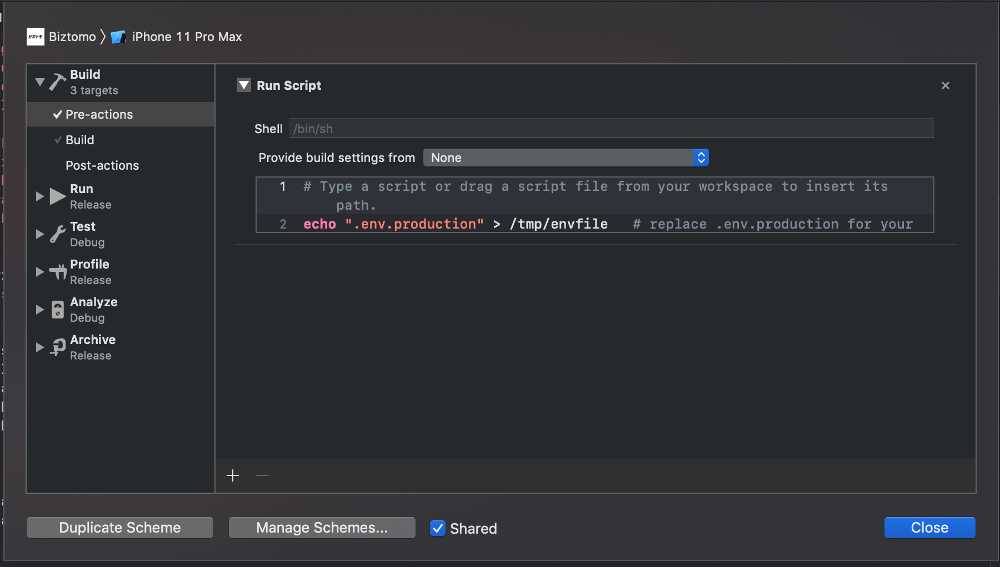

## ``react-native-config`` (Config variables for React Native apps)

## IOS
#### Step 1
##### Availability in Build settings and Info.plist
With one extra step environment values can be exposed to "Info.plist" and Build settings in the native project.

1. click on the file tree and create new file of type XCConfig
   
   
2. save it under `ios` folder as "Config.xcconfig" with the following content:

```
#include? "tmp.xcconfig"
```

3. add the following to your ".gitignore":
```
# react-native-config codegen
ios/tmp.xcconfig

```
#### Step 2
##### Go to project settings
Apply ``Config`` to your configurations
   

#### Step 3
Add ``.env`` to your schema
- Expand the "Build" settings on left
- Click "Pre-actions", and under the plus sign select "New Run Script Action"
- Where it says "Type a script or drag a script file", type:
    ```
    echo ".env.staging" > /tmp/envfile   # replace .env.staging for your file
    ```

   

#### Step 4 add to your pod file 
```js
  post_install do |installer|
   installer.pods_project.targets.each do |target|
     if target.name == ‘react-native-config’
        phase = target.project.new(Xcodeproj::Project::Object::PBXShellScriptBuildPhase)
        phase.shell_script = “cd ../../“\
        ” && RNC_ROOT=./node_modules/react-native-config/“\
        ” && export SYMROOT=$RNC_ROOT/ios/ReactNativeConfig”\
        ” && ruby $RNC_ROOT/ios/ReactNativeConfig/BuildDotenvConfig.ruby”
        target.build_phases << phase
        target.build_phases.move(phase,0)
      end
    end
   end
```

#### Step 5
- Go to your project -> ``Build Settings`` -> ``All``
- Search for ``preprocess``
- Set Preprocess ``Info.plist`` File to ``Yes``
- Set ``Info.plist`` Preprocessor Prefix File to ``${BUILD_DIR}/GeneratedInfoPlistDotEnv.h``
- Set ``Info.plist`` Other Preprocessor Flags to ``-traditional``

### Native Usage
Read variables declared in `.env` from your Obj-C classes like:

```objective-c
// import header
#import "ReactNativeConfig.h"

// then read individual keys like:
NSString *apiUrl = [ReactNativeConfig envFor:@"API_URL"];

// or just fetch the whole config
NSDictionary *config = [ReactNativeConfig env];
```

## Android
### Config
The same environment variable can be used to assemble releases with a different config:

```
$ cd android && ENVFILE=.env.staging ./gradlew assembleRelease
```

Alternatively, you can define a map in `build.gradle` associating builds with env files. Do it before the `apply from` call, and use build cases in lowercase, like:

```
project.ext.envConfigFiles = [
    debug: ".env.development",
    release: ".env.production",
    anothercustombuild: ".env",
]

apply from: project(':react-native-config').projectDir.getPath() + "/dotenv.gradle"
```

### Native Usage
Config variables set in `.env` are available to your Java classes via `BuildConfig`:

```java
public HttpURLConnection getApiClient() {
    URL url = new URL(BuildConfig.API_URL);
    // ...
}
```

You can also read them from your Gradle configuration:

```groovy
defaultConfig {
    applicationId project.env.get("APP_ID")
}
```

And use them to configure libraries in `AndroidManifest.xml` and others:

```xml
<meta-data
  android:name="com.google.android.geo.API_KEY"
  android:value="@string/GOOGLE_MAPS_API_KEY" />
```

All variables are strings, so you may need to cast them. For instance, in Gradle:

```
versionCode project.env.get("VERSION_CODE").toInteger()
```

Once again, remember variables stored in `.env` are published with your code, so **DO NOT put anything sensitive there like your app `signingConfigs`.**
